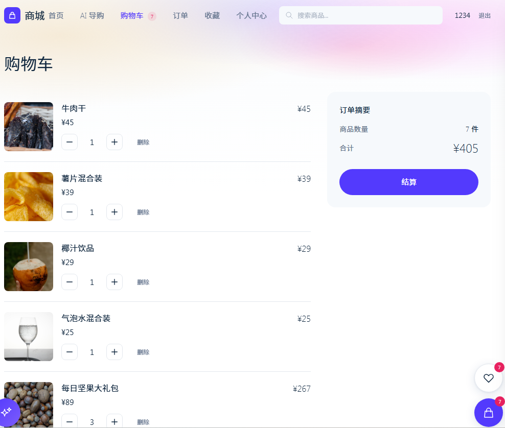
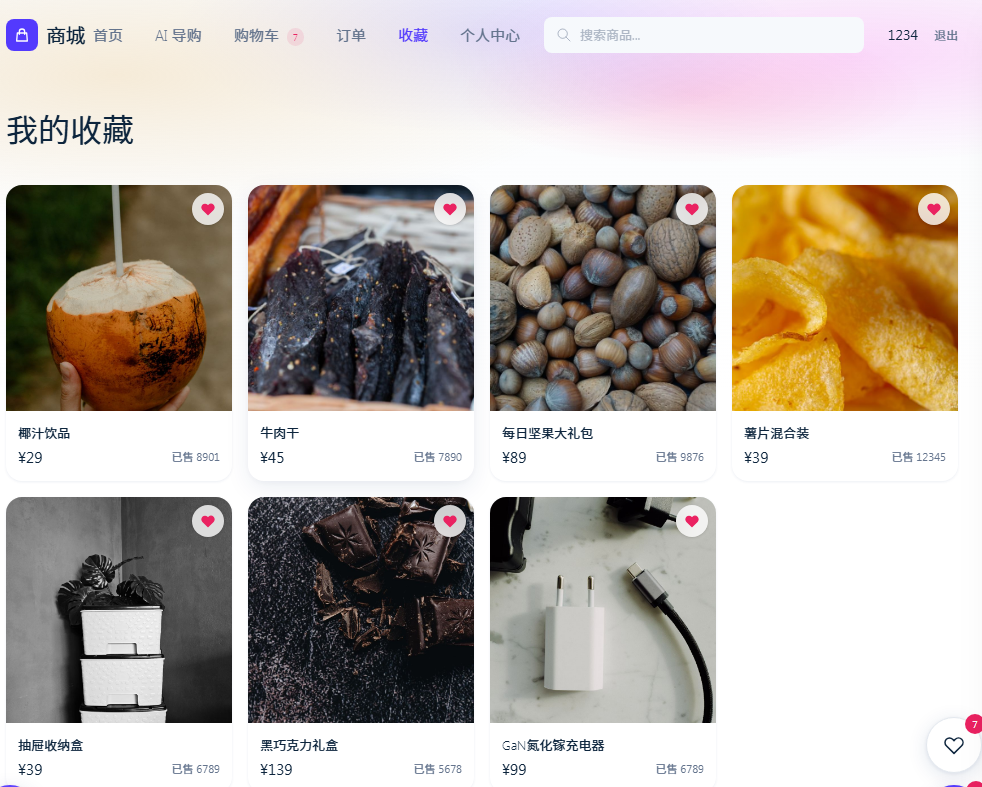
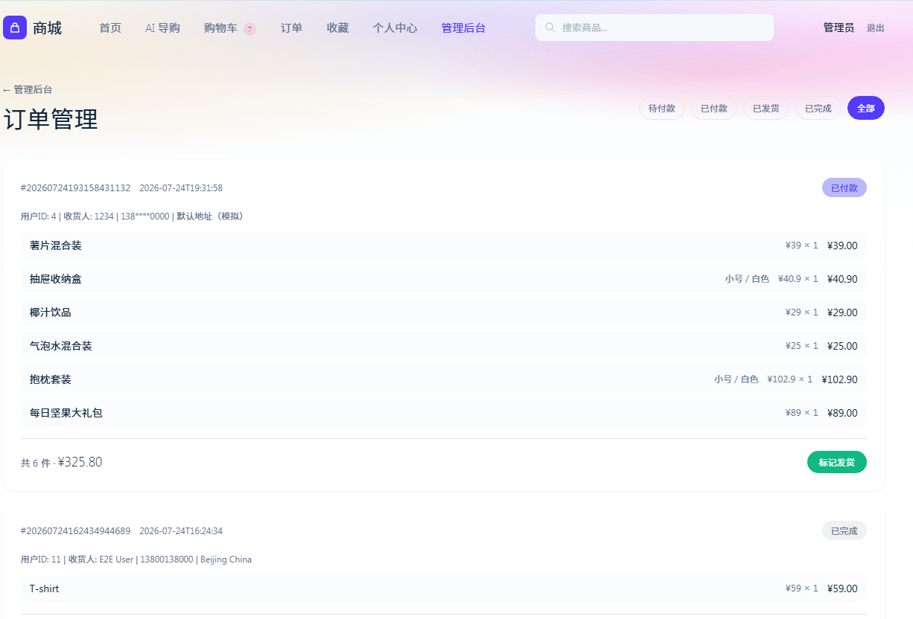
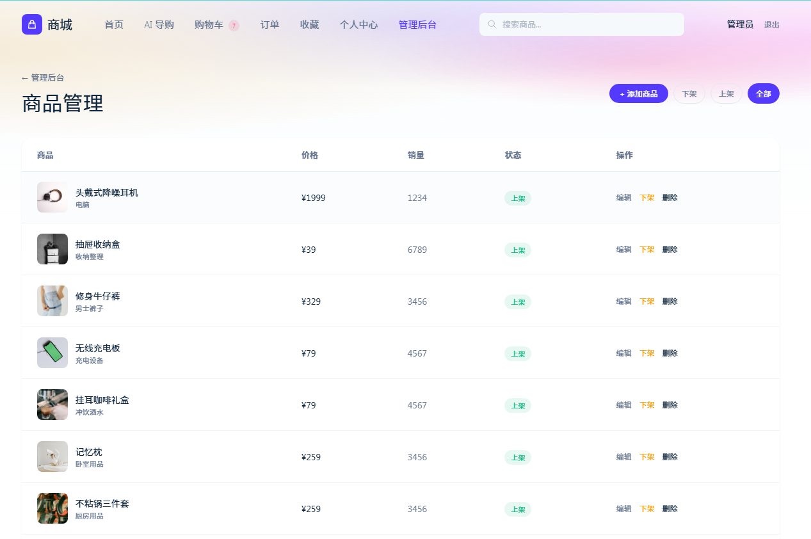

# 微服务电商智能导购平台

基于 **Spring Cloud Alibaba + RAG + 大模型** 的电商平台。在常规微服务电商功能（商品、购物车、订单、用户）之上，增加了一个 AI 导购服务：用户用自然语言描述需求，服务通过 **RAG（检索增强生成）** 从商品库中检索候选商品，再交给大模型生成推荐回答。

---

## 目录

- [技术栈](#技术栈)
- [系统架构](#系统架构)
- [目录结构](#目录结构)
- [环境要求](#环境要求)
- [配置说明](#配置说明) ← **首次运行请先看这里**
- [快速开始](#快速开始)
- [接口一览](#接口一览)
- [界面截图](#界面截图)
- [开发日志](#开发日志)

---

## 技术栈

**后端**

| 组件 | 版本 | 说明 |
|---|---|---|
| Java | 17 | |
| Spring Boot | 3.2.5 | |
| Spring Cloud | 2023.0.3 | |
| Spring Cloud Alibaba | 2023.0.1.0 | Nacos 注册中心 / Sentinel 熔断限流 |
| MyBatis-Plus | 3.5.7 | |
| Druid | 1.2.22 | 数据库连接池 |
| MySQL | 8.x | |
| Redis | — | 购物车存储 |
| JWT (jjwt) | — | 无状态鉴权 |

**前端**

| 组件 | 说明 |
|---|---|
| Vue 3 | Composition API + `<script setup>` |
| Vite | 构建工具，开发端口 3000 |
| Pinia | 状态管理 |
| Vue Router | 路由 |
| Tailwind CSS 4 | 样式 |
| MSW | Mock Service Worker，前端独立开发时可脱离后端运行 |

**AI / RAG**

| 组件 | 说明 |
|---|---|
| DeepSeek API | 对话生成（OpenAI 兼容协议） |
| RAG 向量检索 | 自研轻量实现，无需外部向量库 |
| 嵌入方案 | `ngram`（本地中文 n-gram 哈希，开箱即用）/ `openai`（兼容 OpenAI Embedding API，如 SiliconFlow BGE-M3） |
| 混合检索 | 向量语义检索（权重 0.6）+ 关键词精确匹配（权重 0.4），融合重排 |

---

## 系统架构

```
                        ┌──────────────────┐
                        │   前端 Vue 3      │
                        │   localhost:3000 │
                        └────────┬─────────┘
                                 │ /api/**
                                 ▼
                        ┌──────────────────┐
                        │  eshop-gateway   │  ← JWT 鉴权、路由转发、Sentinel 限流
                        │      :8086       │
                        └────────┬─────────┘
                                 │
        ┌────────────┬───────────┼───────────┬────────────┐
        ▼            ▼           ▼           ▼            ▼
   ┌─────────┐ ┌──────────┐ ┌─────────┐ ┌─────────┐ ┌──────────┐
   │  user   │ │ product  │ │  cart   │ │  order  │ │ ai-guide │
   │  :8081  │ │  :8082   │ │ :8083   │ │ :8084   │ │  :8085   │
   └────┬────┘ └────┬─────┘ └────┬────┘ └────┬────┘ └────┬─────┘
        │           │            │           │           │
        ▼           ▼            ▼           ▼           ▼
     MySQL       MySQL        Redis       MySQL       MySQL
   eshop_user  eshop_product eshop_cart eshop_order  eshop_ai
                                                        │
                                                        ▼
                                              RAG 检索 + DeepSeek API
```

所有服务注册到 **Nacos**（`localhost:8848`），服务间通过 **OpenFeign** 调用并集成 **Sentinel** 熔断降级。

**AI 导购的完整 RAG 流程：**

```
用户提问
  → 查询理解（提取品类 / 预算 / 用途等意图）
  → 双路混合检索（向量语义 + 关键词精确）
  → 融合重排（0.6 × 向量分 + 0.4 × 关键词分）
  → 商品上下文注入 Prompt
  → DeepSeek 生成
  → SSE 流式返回前端（逐字输出）
```

---

## 目录结构

```
.
├── springcloud-eshop/              # 后端 Maven 多模块工程
│   ├── pom.xml                     # 父 POM，统一版本管理
│   ├── eshop-common/               # 公共模块：统一响应体、异常、常量、分页
│   ├── eshop-gateway/              # 网关：路由、CORS、JWT 全局过滤器
│   ├── eshop-user-service/         # 用户服务：注册登录、地址管理
│   ├── eshop-product-service/      # 商品服务：商品、分类、SKU、属性、图片
│   ├── eshop-cart-service/         # 购物车服务：基于 Redis
│   ├── eshop-order-service/        # 订单服务：下单、状态流转
│   ├── eshop-ai-guide-service/     # AI 导购服务：RAG 检索 + DeepSeek 对话
│   │   └── src/main/java/com/eshop/ai/
│   │       ├── vector/             # 向量存储与嵌入实现（可插拔）
│   │       ├── service/            # 对话、索引、DeepSeek 调用
│   │       ├── feign/              # 调用商品服务
│   │       └── controller/
│   ├── sql/                        # 数据库脚本
│   └── docs/                       # 开发日志
│
├── frontend/                       # 前端 Vue 3 工程
│   ├── src/
│   │   ├── views/                  # 页面（含 admin/ 后台管理）
│   │   ├── components/             # 组件（AI 对话面板、购物车侧栏等）
│   │   ├── stores/                 # Pinia 状态
│   │   ├── api/                    # 接口封装
│   │   └── mock/                   # MSW mock（脱离后端独立开发用）
│   └── public/images/products/     # 商品图片静态资源
│
├── 图片/                            # 界面截图（README 用）
├── start.sh                        # 一键启动（Linux / macOS / Git Bash）
├── start.bat                       # 一键启动（Windows）
└── README.md
```

---

## 环境要求

| 依赖 | 版本 | 必需 |
|---|---|---|
| JDK | 17+ | ✅ |
| Maven | 3.8+ | ✅ |
| MySQL | 8.x | ✅ |
| Node.js | 18+ | ✅ |
| Redis | 6+ | ✅ |
| Nacos | 2.3.x | ✅（需自行下载，见下） |
| DeepSeek API Key | — | ⭕ 仅 AI 导购功能需要 |

---

## 配置说明

> **这一节是首次运行的关键。** 仓库中不包含任何密钥、也不包含 Nacos 等大体积运行时依赖，需要你按下面的步骤补齐。

### 1. DeepSeek API Key（AI 导购功能必需）

出于安全考虑，**仓库中的配置文件不包含任何 API Key**，必须通过环境变量注入。

申请地址：<https://platform.deepseek.com/api_keys>

**Linux / macOS / Git Bash**

```bash
export DEEPSEEK_API_KEY=sk-你的真实key
```

**Windows CMD**

```cmd
set DEEPSEEK_API_KEY=sk-你的真实key
```

**Windows PowerShell**

```powershell
$env:DEEPSEEK_API_KEY="sk-你的真实key"
```

**IntelliJ IDEA**：`Run` → `Edit Configurations` → 选中 `EshopAiApplication` → `Environment variables` 填入 `DEEPSEEK_API_KEY=sk-你的真实key`

> **未配置 Key 会怎样？**
> 应用**仍可正常启动**，商品、购物车、订单等所有功能不受影响，**只有 AI 导购对话不可用**。
> 想确认是否配置成功，访问健康检测接口：
>
> ```bash
> curl http://localhost:8085/api/ai/health
> ```
>
> 未配置时返回 `"deepseekStatus": "NOT_CONFIGURED"` 并附带提示；配置正确则为 `"UP"`。

### 2. Nacos（必需，需自行下载）

Nacos 体积约 250MB，**未随仓库提供**。请自行下载后解压到 `work/nacos/`：

<https://github.com/alibaba/nacos/releases>（推荐 2.3.x）

```bash
# 解压后确保目录结构为：
# work/nacos/bin/startup.sh   (Linux/macOS)
# work/nacos/bin/startup.cmd  (Windows)
```

也可以不放到 `work/` 下，只要先手动启动 Nacos（单机模式）再运行启动脚本即可：

```bash
sh startup.sh -m standalone     # Linux / macOS
startup.cmd -m standalone       # Windows
```

### 3. 数据库

创建库表并导入示例数据，**按以下顺序执行**：

```bash
cd springcloud-eshop/sql

mysql -u root -p < init.sql                      # 建库建表（5 个库）
mysql -u root -p < migration_001_sku_attributes.sql
mysql -u root -p < migration_002_order_sku.sql
mysql -u root -p < ai_init.sql                   # AI 对话消息表
mysql -u root -p < data_products.sql             # 商品示例数据
```

默认连接配置为 `localhost:3306` / `root` / `123456`，如需修改，编辑各服务下的 `src/main/resources/application.yml`。

涉及数据库：`eshop_user`、`eshop_product`、`eshop_order`、`eshop_ai`（`eshop_cart` 数据实际存于 Redis）。

### 4. 商品图片路径

商品图片默认从仓库内的 `frontend/public/images/` 读取。后端 `eshop-product-service` 通过配置项映射该目录：

```yaml
# eshop-product-service/src/main/resources/application.yml
eshop:
  images:
    location: file:../frontend/public/images/
```

该路径相对于**服务的启动目录**。若你的启动目录不同、或图片放在别处，改成绝对路径即可：

```yaml
eshop:
  images:
    location: file:/your/absolute/path/images/
```

### 5. 可选配置

| 配置项 | 默认值 | 说明 |
|---|---|---|
| `DEEPSEEK_MODEL` | `deepseek-v4-flash` | 对话模型 |
| `DEEPSEEK_BASE_URL` | `https://api.deepseek.com` | API 地址，兼容其他 OpenAI 协议服务 |
| `EMBEDDING_API_KEY` | 空 | 启用外部嵌入服务时需要 |
| `EMBEDDING_BASE_URL` | `https://api.siliconflow.cn/v1` | 嵌入服务地址 |
| `EMBEDDING_MODEL` | `BAAI/bge-m3` | 嵌入模型 |

**关于嵌入方案**：默认 `provider: ngram`，使用本地中文 n-gram 哈希嵌入，**无需任何外部 API，开箱即用**，适合快速体验。若追求更好的检索效果，可将 `application.yml` 中 `vector.embedding.provider` 改为 `openai` 并配置 `EMBEDDING_API_KEY`（SiliconFlow 的 BGE-M3 可免费注册使用）。

---

## 快速开始

### 方式一：一键启动脚本

先按[配置说明](#配置说明)准备好环境变量与 Nacos，然后：

```bash
# Linux / macOS / Git Bash
bash start.sh
```

```cmd
REM Windows
start.bat
```

脚本会自动检查 Nacos / MySQL / Redis，依次启动 6 个后端服务与前端，并给出访问地址。

### 方式二：手动启动

**1. 构建后端**

```bash
cd springcloud-eshop
mvn clean package -DskipTests
```

**2. 启动后端服务**（建议按此顺序，每个开一个终端）

```bash
java -jar eshop-gateway/target/eshop-gateway-app.jar            # :8086
java -jar eshop-user-service/target/eshop-user-service-1.0.0.jar       # :8081
java -jar eshop-product-service/target/eshop-product-service-1.0.0.jar # :8082
java -jar eshop-cart-service/target/eshop-cart-service-1.0.0.jar       # :8083
java -jar eshop-order-service/target/eshop-order-service-1.0.0.jar     # :8084
java -jar eshop-ai-guide-service/target/eshop-ai-guide-service-1.0.0.jar # :8085
```

**3. 启动前端**

```bash
cd frontend
npm install     # 首次运行
npm run dev     # http://localhost:3000
```

### 访问地址

| 服务 | 地址 |
|---|---|
| 前端 | <http://localhost:3000> |
| 后端网关 | <http://localhost:8086> |
| Nacos 控制台 | <http://localhost:8848/nacos>（默认 nacos/nacos） |
| Sentinel 控制台 | <http://localhost:8718>（可选） |

---

## 接口一览

所有请求经网关 `http://localhost:8086` 转发。

| 模块 | 前缀 | 示例 |
|---|---|---|
| 用户 | `/api/user/**` | `POST /api/user/register`、`POST /api/user/login` |
| 商品 | `/api/product/**` | `GET /api/product/page`、`GET /api/product/category/tree` |
| 购物车 | `/api/cart/**` | `GET /api/cart/list` |
| 订单 | `/api/order/**` | `POST /api/order/create` |
| AI 导购 | `/api/ai/**` | `POST /api/ai/chat/stream`（SSE 流式） |

**AI 导购相关接口：**

```bash
# 健康检测（含 DeepSeek Key 配置状态）
curl http://localhost:8085/api/ai/health

# 流式对话（SSE）
curl -N -X POST http://localhost:8085/api/ai/chat/stream \
  -H "Content-Type: application/json" \
  -H "X-User-Id: 1" \
  -d '{"message":"推荐一款适合跑步的耳机","conversationId":0}'
```

---

## 界面截图

| 首页 | AI 导购 |
|---|---|
|  |  |

| 购物车 | 收藏 |
|---|---|
|  |  |

| 订单管理 | 商品管理 |
|---|---|
|  |  |

---

## 开发日志

开发过程中的问题排查与技术决策记录在 [`springcloud-eshop/docs/dev-log.md`](springcloud-eshop/docs/dev-log.md)，包含 SSE 流式响应 400 问题定位、前后端 SSE 解析格式不一致等真实排障过程。

另见 [`springcloud-eshop/docs/2026-07-24-修复日志.md`](springcloud-eshop/docs/2026-07-24-修复日志.md)。
